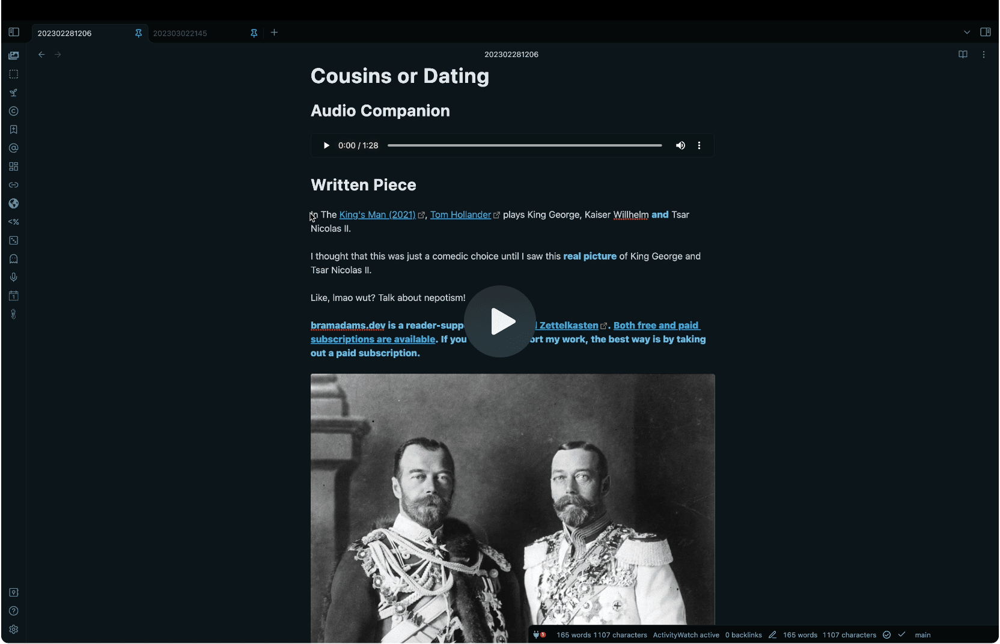

# ChatGPT-MD

A (nearly) seamless integration of ChatGPT into Obsidian.

## Demo

https://user-images.githubusercontent.com/3282661/223005882-6632c997-b9a6-445b-800c-77a4b76a6325.mov

### (youtube mirror - for mobile users ⬇️)

[](https://youtu.be/CxDlol_DDI8)

## Features

-   Chat from _any_ MD note
-   Create Chat _Templates_ for sharing and running similar scenarios. Check out the companion repo [chatgpt-md-templates](https://github.com/bramses/chatgpt-md-templates) for some templates!
-   As _minimal boilerplate as possible_, only two required in fact! `<hr class="__cerebro_plugin">` and `role::system|assistant|user`
-   Use _frontmatter_ to change variables for the ChatGPT API
-   _Stream_ characters to Obsidian, creating a realtime feel
-   Uses _regular Markdown_. Meaning everything from _lists_ to _code blocks_ from ChatGPT _will render_!
-   Create chats from _highlighted text_.
-   [_Infer title_ from messages](https://github.com/bramses/chatgpt-md/discussions/11). Can be set to run automatically after >4 messages.
-   Stream at cursor position or at end of file. Can be set in settings.
-   Choose [heading level for role](https://github.com/bramses/chatgpt-md/pull/22) h1-h6. Can be set in settings.
-   Custom endpoints can be specified using the url parameter in your front matter. See FAQ for an example.
-   Stop a running stream with a command. See commands section below.
-   (NEW!) Choose between nine languages for "Infer Title". Can be set in settings.
-   (NEW!) ChatGPT comment blocks. Allows you to leave scratchpad notes, backlinks...or anything else really!! See command below for details.

### Commands

#### Chat

The main command! Parses the file and calls ChatGPT. Recommended to add to a hotkey for easy usage.

#### Create New Chat with Highlighted Text

Take currently highlighted text and default frontmatter and create a new chat file in `Chat Folder`

#### Create New Chat From Template

Create a new chat file from a template specified in `Chat Template Folder`. Remember to check out [chatgpt-md-templates](https://github.com/bramses/chatgpt-md-templates) for some templates!

#### Infer Title

[Infer the title of the chat from the messages](https://github.com/bramses/chatgpt-md/discussions/11). Requires at least 2 messages. Can be set in settings to run automatically after >4 messages.

#### Add comment block

Add a comment block to the editor that will not be processed by ChatGPT. Allows you to leave scratchpad notes, backlinks...or anything else really!

Comments begin with `=begin-chatgpt-md-comment` and end with `=end-chatgpt-md-comment`


#### Clear Chat

Removes all messages but leaves frontmatter

#### Stop Streaming (Does not work on mobile)

Stops the stream. Useful if you want to stop the stream if you don't like where ChatGPT is heading/going too long.

#### Add Divider

Add a ChatGPT MD Horizontal Rule and `role::user`.

**!! Note: both `role::system|assistant|user` AND `<hr class="__cerebro_plugin">` are REQUIRED for the plugin to work!!**

## Installation

### Community Plugins

Go to Community Plugins and search `ChatGPT MD`

### Local

1. Clone this repo into your `plugins` directory in your vault
2. Run `npm i` and `npm run build`

### Both

1. Insert your OpenAI API Key into the settings
2. Set `Chat Folder` and `Chat Template Folder`
3. Add a hotkey for `Chat` (Im using `alt-[`)

## FAQ

### Q: The chat seems to be getting cut off halfway through

To address this, first try to increase your `max_tokens` (default is set to 300). You may also want to update it more permanently in the default frontmatter settings. See pics below:


### Q: Code Blocks cut off halfway through and leave \`\`\`

The Obsidian editor renders backticks in automatically (see [issue](https://github.com/bramses/chatgpt-md/issues/15#issuecomment-1466813500)) and fires extra logic that causes the stream to add extra backticks. To address this, you can:

1. at the end of the code block add \`\`\` (three backticks) to close the code block BEFORE the `<hr>` and delete the three extra Obsidian added automatically.
2. in `role::user` write "keep going"

See pics below:


### Q: How do I use GPT-4?

If you are off the [waitlist](https://openai.com/waitlist/gpt-4-api), simply replace `model: gpt-3.5-turbo` with `model: gpt-4` in the frontmatter. (_note: gpt-4 is slower than turbo!_)

### Q: How do I use a custom endpoint?

```md
---
system_commands: ['I create small self contained app ideas that could fit in a CodePen or a Replit']
url: https://localhost
---
```

The custom API must conform to the OpenAI API spec. eg you could use Azure's OpenAI hosted endpoints here. Refer to your provider for API key handling.

---

### Development

#### Project Structure

```
main.ts: Plugin management, initializes settings and objects such as LLM clients, registers commands
models/openAIClient.ts: OpenAI client inheriting the Client interface
models/anthropicClient.ts: Anthropic client inheriting the Client interface
views/settings.ts: Settings tab
constants.ts: Constants for package-wide use
types.ts: Types for package-wide use
```
